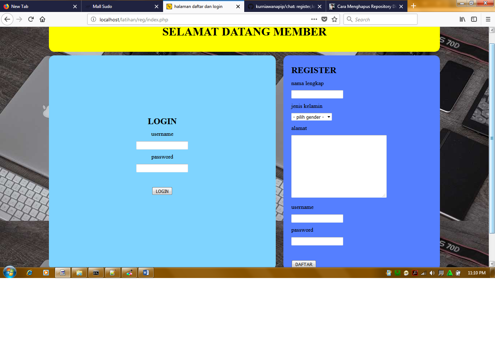
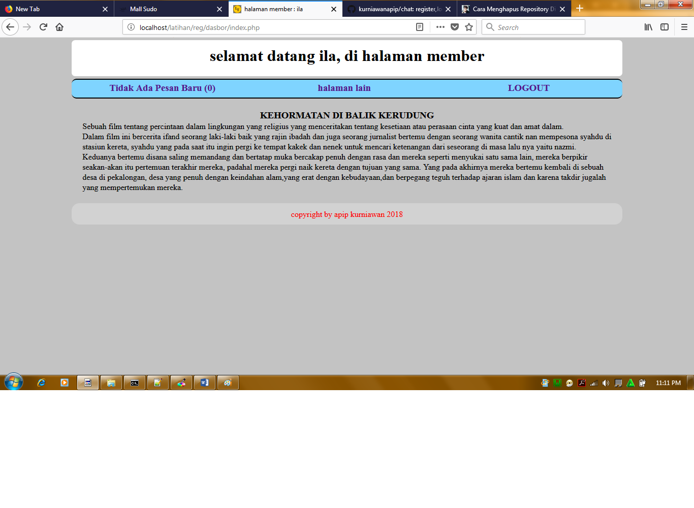
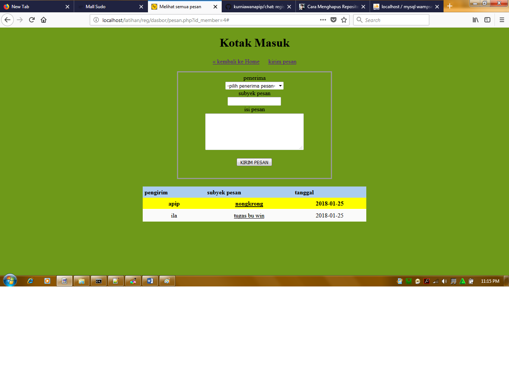
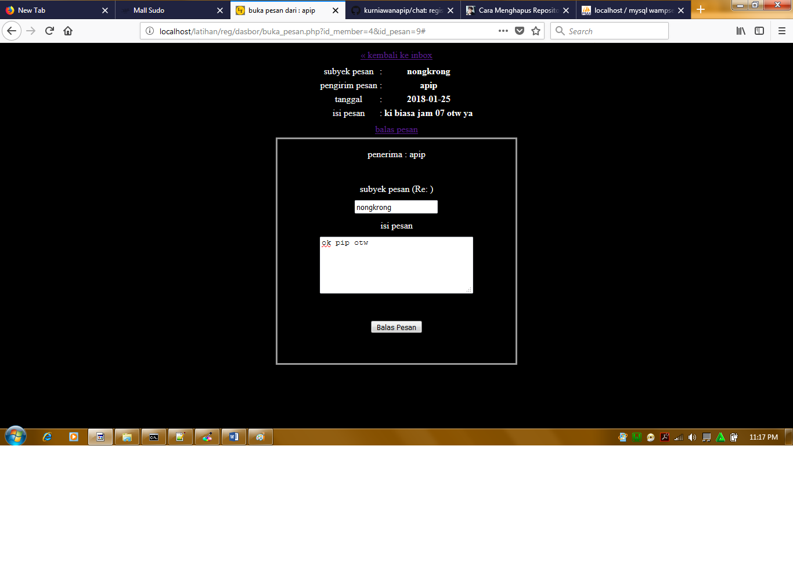

# chat
register,login,dan aplikasi chat di lengkapi dengan session.

belajar membuat sistem login sederhana di mulai dengan mengisi form registrasi setelah itu login dan masuk ke halaman index
yang bisa mengolah lihat pesan masuk kirim/balas pesan..  

halaman register dan login 

halaman index

halaman kotak masuk dan kirim pesan. (warna kuning artinya pesan belum di baca)

halaman balas pesan

